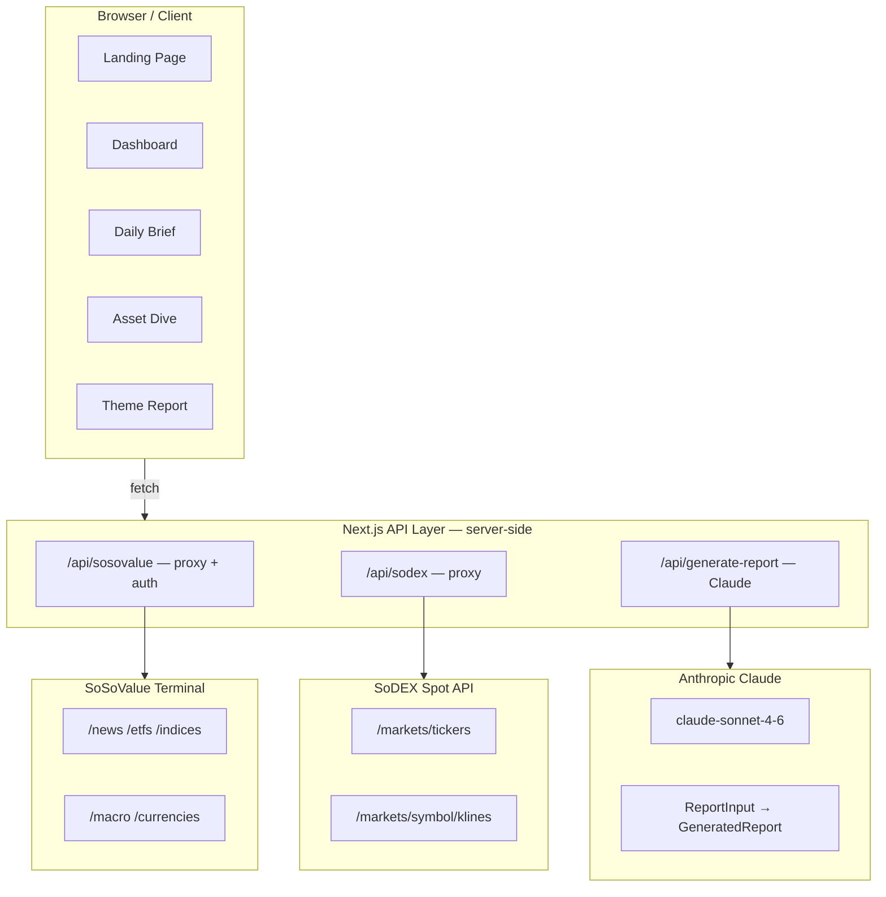
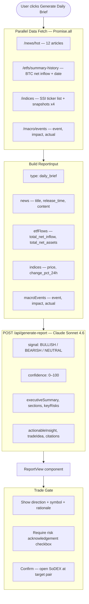
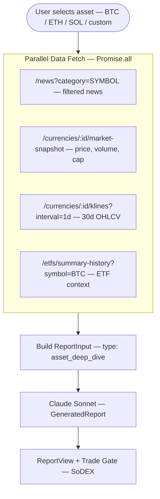
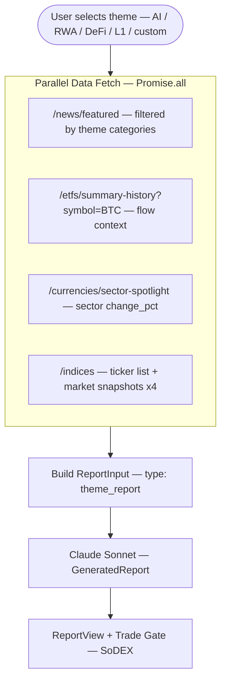
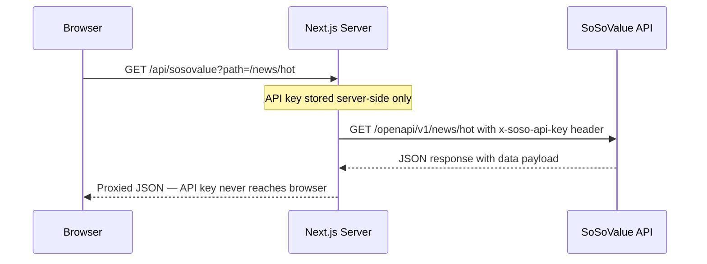

# SoSo Analyst

**Autonomous On-Chain Research Agency** — Built for the SoSoValue Buildathon Wave 1

> Institutional-quality crypto research powered by SoSoValue Terminal, Claude AI, and executed on SoDEX.

## What It Does

SoSo Analyst is the first on-chain financial **research agency** built on SoSoValue's infrastructure. While every other hackathon submission builds a trading bot, SoSo Analyst builds the **research layer** — the Bloomberg for on-chain finance.

| Feature | Description |
|---|---|
| **Daily Market Brief** | Auto-generated from SoSoValue `/news/hot`, `/etfs/summary-history`, `/indices`, `/macro/events` |
| **Asset Deep Dive** | Full research report on any token via `/currencies/{id}/market-snapshot`, `/klines`, `/news` |
| **Theme Reports** | Narrative-driven sector research from `/news/featured`, `/sector-spotlight`, ETF flows |
| **SoDEX Integration** | Live market prices, order book, and one-click trade execution with confirmation gate |
| **AI Signal Layer** | Claude Sonnet generates BULLISH / BEARISH / NEUTRAL signal with confidence score |

## Architecture

### System Overview



---

### Daily Market Brief Flow



---

### Asset Deep Dive Flow



---

### Theme Report Flow



---

### API Proxy Security Flow



## SoSoValue API Endpoints Used

- `GET /news/hot` — Hot news for landing page and daily brief
- `GET /news/featured` — Featured news for theme reports
- `GET /news?category={symbol}` — Asset-specific news for deep dives
- `GET /etfs/summary-history` — ETF aggregate flows (BTC + ETH)
- `GET /currencies/{id}/market-snapshot` — Real-time price, volume, market cap
- `GET /currencies/{id}/klines` — Historical OHLCV data
- `GET /currencies/sector-spotlight` — Sector performance data
- `GET /indices` — SSI index list
- `GET /macro/events` — Macro economic events

## SoDEX API Endpoints Used

- `GET /markets/tickers` — Live price tickers (displayed in header strip)
- `GET /markets/{symbol}/orderbook` — Order book depth for trade preview
- `GET /markets/{symbol}/klines` — Price chart data

## Setup

```bash
git clone https://github.com/fourWayz/soso-analyst
cd soso-analyst
npm install

# Configure API keys
cp .env.local.example .env.local
# Add your SOSOVALUE_API_KEY and ANTHROPIC_API_KEY

npm run dev
# Open http://localhost:3000
```

## Environment Variables

```env
SOSOVALUE_API_KEY=      # SoSoValue Terminal API key
ANTHROPIC_API_KEY=      # Anthropic API key (claude-sonnet-4-6)
```

## Tech Stack

- **Framework**: Next.js 15 (App Router, TypeScript)
- **Styling**: Tailwind CSS (dark Bloomberg-style UI)
- **AI**: Claude Sonnet 4.6 via Anthropic SDK
- **Data**: SoSoValue Terminal API (primary), SoDEX Spot API
- **Deployment**: Vercel

## Wave 1 Deliverables

- [x] Concept validated: on-chain research agency (unique category vs all other submissions)
- [x] SoSoValue API integrated: 9+ endpoints across news, ETF, indices, currencies, macro
- [x] SoDEX API integrated: tickers, order book, klines
- [x] Claude AI report engine: Daily Brief, Asset Deep Dive, Theme Report
- [x] Trade gate: confirmation-gated SoDEX order flow
- [x] Live dashboard: ETF flows, SSI indices, news feed, market prices
- [x] Deployed to Vercel

## Project Overview

**Target users**: Crypto traders, DeFi participants, and on-chain investors who need institutional-quality research but don't have Bloomberg Terminal access or a research team.

**Core logic**: SoSoValue data ingestion → Claude AI synthesis → Structured research report → SoDEX execution gate

**APIs used**: SoSoValue Terminal (news, ETF, indices, macro, currencies), SoDEX Spot (tickers, orderbook), Anthropic (Claude Sonnet 4.6)

**Unique value**: Every other submission produces trade signals. SoSo Analyst produces *research* — the reasoning behind the signal, with citations, risk factors, and a complete narrative. This is the Bloomberg, not the Reuters ticker.

