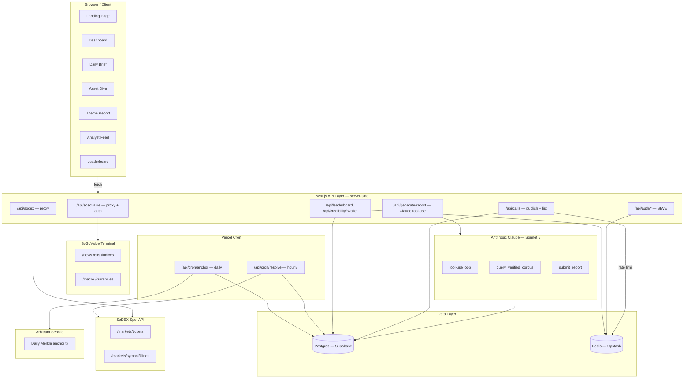
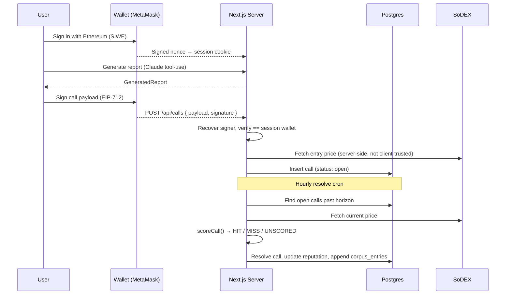
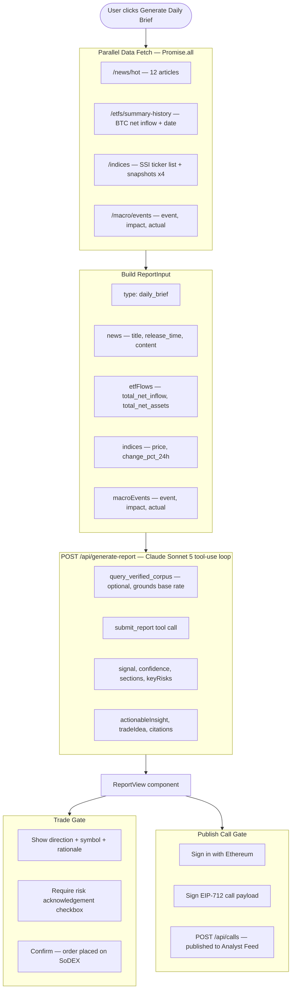
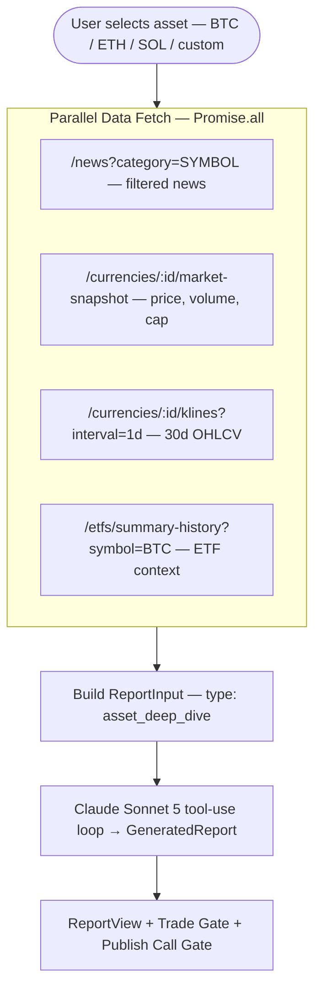
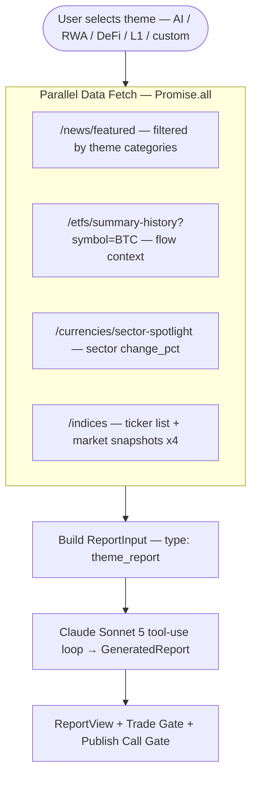
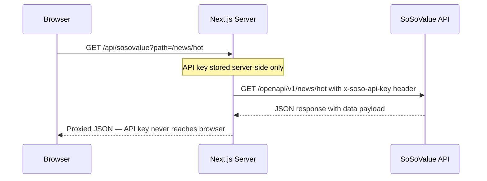

# SoSo Analyst

**Verified On-Chain Research Protocol** — Built for the SoSoValue Buildathon

> Institutional-quality crypto research powered by SoSoValue Terminal and Claude AI — published as EIP-712 signed calls, scored automatically against live SoDEX prices, and anchored on-chain for tamper-evidence.

## What It Does

SoSo Analyst started as an on-chain research agency — structured reports instead of blind trading signals. Wave 3 turns that into something no other submission has: a **verification layer**. Any analyst — our AI or a human — signs a falsifiable call with their wallet, publishes it, and gets scored automatically against real market outcomes. No self-reported accuracy, no localStorage pretending to be a ledger — every claim in the Analyst Feed is a row in Postgres, resolved by a cron job against live SoDEX prices, and rolled up into a public, wallet-scoped reputation score.

| Feature | Description |
|---|---|
| **Daily Market Brief** | Auto-generated from SoSoValue `/news/hot`, `/etfs/summary-history`, `/indices`, `/macro/events` |
| **Asset Deep Dive** | Full research report on any token via `/currencies/{id}/market-snapshot`, `/klines`, `/news`, `/token-economics` |
| **Theme Reports** | Narrative-driven sector research from `/news/featured`, `/sector-spotlight`, ETF flows |
| **Analyst Feed** | EIP-712 signed calls, published to Postgres, auto-resolved against live SoDEX prices — not `localStorage` |
| **Reputation Leaderboard** | Rolling, confidence-weighted score per wallet, ranked publicly at `/leaderboard` |
| **Credibility API** | `GET /api/credibility/:wallet` — a public, cacheable trust-score endpoint other products can query |
| **Verified Corpus** | Every resolved call feeds `corpus_entries`; Claude calls `query_verified_corpus` mid-reasoning to ground its own view in real outcomes instead of asserting a base rate from prior knowledge |
| **On-Chain Anchoring** | A daily cron batches that day's call hashes into one Merkle root and broadcasts it on Arbitrum Sepolia — tamper-evidence at one transaction per day, regardless of call volume |
| **EIP-712 Trade Signing** | MetaMask wallet connect → typed data signing → direct order submission to SoDEX matching engine |
| **Sign-In With Ethereum** | Wallet identity is a real verified session (`iron-session` + SIWE), not a display string |

## Architecture

### System Overview



---

### Publish & Resolve Call Flow



---

### Daily Market Brief Flow



---

### Asset Deep Dive Flow



---

### Theme Report Flow



---

### API Proxy Security Flow



## The Analyst Feed & Reputation System

This is the core of Wave 3. Every other submission in this category produces signals or research; nothing else lets any analyst — human or agent — stake a falsifiable claim and get scored on it in public.

- **Publishing** (`POST /api/calls`) requires a signed-in wallet (SIWE) and an EIP-712 signature over the exact asset, direction, confidence, horizon, and a hash of the thesis text — the call can't be edited after signing, and the signature is verified server-side against the session wallet before it's accepted.
- **Entry price is fetched server-side** from SoDEX at publish time, never trusted from the client — a caller can't backdate a favorable entry to game their own outcome.
- **Resolution** runs hourly (`/api/cron/resolve`): once a call's horizon (1h / 24h / 72h / 7d) elapses, the current SoDEX price is fetched, `scoreCall()` computes a magnitude- and confidence-weighted score, and the call is marked `HIT`, `MISS`, or `UNSCORED` (NEUTRAL calls, or assets with no SoDEX market, are honestly left unscored rather than faked).
- **Reputation** is a rolling EMA over each wallet's resolved call scores — recent calls matter more, but no single bad call tanks a long track record.
- **The verified corpus** (`corpus_entries`) is populated automatically from every resolved call. Claude's report generation can call `query_verified_corpus` mid-reasoning to check the real historical base rate for an asset before asserting a directional view — the AI is grounded in the platform's own accumulating track record, not just restated news.
- **On-chain anchoring** (`/api/cron/anchor`, daily) batches each day's call hashes into a Merkle root and broadcasts it as calldata on a single Arbitrum Sepolia transaction — full tamper-evidence for the whole day's log at the cost of one cheap tx, not one per call.

## SoSoValue API Endpoints Used

- `GET /news/hot` — Hot news for landing page and daily brief
- `GET /news/featured` — Featured news for theme reports
- `GET /news?category={symbol}` — Asset-specific news for deep dives
- `GET /etfs/summary-history` — ETF aggregate flows (BTC + ETH)
- `GET /currencies/{id}/market-snapshot` — Real-time price, volume, market cap
- `GET /currencies/{id}/klines` — Historical OHLCV data
- `GET /currencies/{id}/token-economics` — Supply, FDV, unlock schedule (Asset Deep Dive)
- `GET /currencies/sector-spotlight` — Sector performance data
- `GET /indices` — SSI index list
- `GET /macro/events` — Macro economic events

## SoDEX API Endpoints Used

- `GET /markets/tickers` — Live price tickers (displayed in header strip)
- `GET /markets/symbols` — Symbol → market ID resolution for order placement
- `GET /markets/{symbol}/orderbook` — Order book depth for trade preview
- `GET /markets/{symbol}/klines` — Price chart data, and the entry/resolution price source for calls
- `POST /trade/orders/batch` — EIP-712 signed order submission

## Setup

```bash
git clone https://github.com/fourWayz/soso-analyst
cd soso-analyst
npm install

# Configure environment
cp .env.local.example .env.local
# Fill in the values described below

# Apply the database schema
npm run db:migrate

npm run dev
# Open http://localhost:3000
```

Requires a Postgres database (this project uses [Supabase](https://supabase.com)) and a [Upstash](https://upstash.com) Redis instance — both have free tiers sufficient for development.

## Environment Variables

```env
# SoSoValue Terminal API key
SOSOVALUE_API_KEY=

# Anthropic API key (claude-sonnet-5)
ANTHROPIC_API_KEY=

# Optional: SoDEX API key for authenticated endpoints
SODEX_API_KEY=

# Postgres — pooled (transaction mode, port 6543) for the app, direct/session
# pooler (port 5432) for migrations
DATABASE_URL=
DIRECT_URL=

# Upstash Redis (REST API, not a raw connection string)
UPSTASH_REDIS_REST_URL=
UPSTASH_REDIS_REST_TOKEN=

# 32+ char random secret for iron-session cookie encryption
SESSION_SECRET=

# Random secret Vercel Cron sends as `Authorization: Bearer $CRON_SECRET`
CRON_SECRET=

# Wallet that broadcasts the daily Merkle anchor tx, and the chain RPC it uses
ANCHOR_PRIVATE_KEY=
ANCHOR_RPC_URL=          # e.g. https://sepolia-rollup.arbitrum.io/rpc
```

## Tech Stack

- **Framework**: Next.js 16 (App Router, TypeScript)
- **Styling**: Tailwind CSS (dark Bloomberg-style UI)
- **AI**: Claude Sonnet 5 via Anthropic SDK — real tool-use loop with prompt caching
- **Database**: Postgres (Supabase) via Drizzle ORM
- **Cache / Rate Limiting**: Redis (Upstash)
- **Auth**: Sign-In With Ethereum (`siwe`) + `iron-session`
- **On-chain**: `viem` — EIP-712 signing/verification, Merkle anchoring on Arbitrum Sepolia
- **Data**: SoSoValue Terminal API (primary), SoDEX Spot API
- **Testing**: Vitest
- **Deployment**: Vercel (including Vercel Cron for the resolve/anchor jobs)

## Testing

```bash
npm test          # run once
npm run test:watch
```

Covers the scoring engine (including the breakeven `-0` edge case), EIP-712 signature recovery (valid, tampered, wrong-signer), and Merkle root construction — all pure-function tests with no database or network dependency.

## Wave 3 Deliverables

- [x] **Real Analyst Feed** — Postgres-backed, SIWE-authenticated, EIP-712 signed calls, replacing the `localStorage` feed and its fake seed data
- [x] **Unified scoring engine** — one multi-horizon, confidence-weighted scorer, replacing two divergent localStorage-based scorers
- [x] **Hourly resolve cron** — scores open calls against live SoDEX prices, updates rolling reputation
- [x] **Real Anthropic tool-use** — replaces regex JSON extraction with a proper tool-use loop and prompt caching
- [x] **`query_verified_corpus`** — Claude grounds its own directional calls in the platform's real, growing outcome history
- [x] **Public leaderboard + `/api/credibility/:wallet`** — the first cross-analyst, cross-product trust surface in this category
- [x] **Daily on-chain Merkle anchoring** — verified live on Arbitrum Sepolia
- [x] **Vitest suite** — 22 tests covering scoring, EIP-712 verification, and Merkle construction

## Wave 2 Deliverables

- [x] **EIP-712 trade signing** — MetaMask wallet connect + typed data signing + direct SoDEX order submission (replaces URL redirect)
- [x] **POST /api/sodex** — server-side proxy for signed order submission to SoDEX matching engine
- [x] **lib/eip712.ts** — reusable wallet helpers: `connectWallet`, `getConnectedAccount`, `signAuthNonce`, `formatAddress`
- [x] **Demo stability** — improved error messages, better input validation, graceful API fallbacks across all routes

## Wave 1 Deliverables

- [x] Concept validated: on-chain research agency (unique category vs all other submissions)
- [x] SoSoValue API integrated: 9+ endpoints across news, ETF, indices, currencies, macro
- [x] SoDEX API integrated: tickers, order book, klines
- [x] Claude AI report engine: Daily Brief, Asset Deep Dive, Theme Report
- [x] Trade gate: confirmation-gated SoDEX order flow
- [x] Live dashboard: ETF flows, SSI indices, news feed, market prices
- [x] Deployed to Vercel

## Project Overview

**Target users**: Crypto traders, DeFi participants, and on-chain investors who need institutional-quality research but don't have Bloomberg Terminal access, a research team, or any way to tell which research is actually worth trusting.

**Core logic**: SoSoValue data ingestion → Claude AI synthesis, grounded in a verified outcome corpus → signed, published call → automatic resolution against live SoDEX prices → public reputation.

**APIs used**: SoSoValue Terminal (news, ETF, indices, macro, currencies), SoDEX Spot (tickers, orderbook, order placement), Anthropic (Claude Sonnet 5, tool-use).


